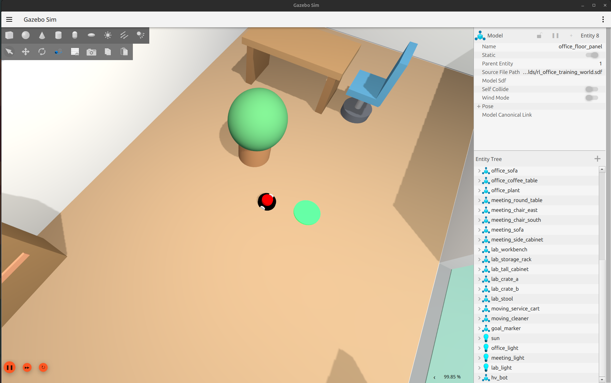
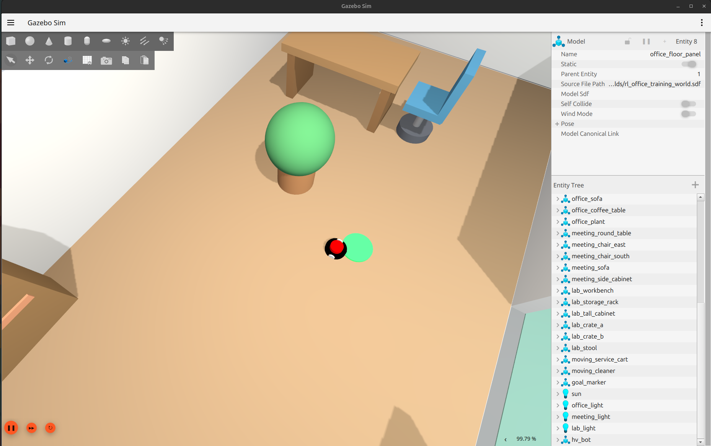
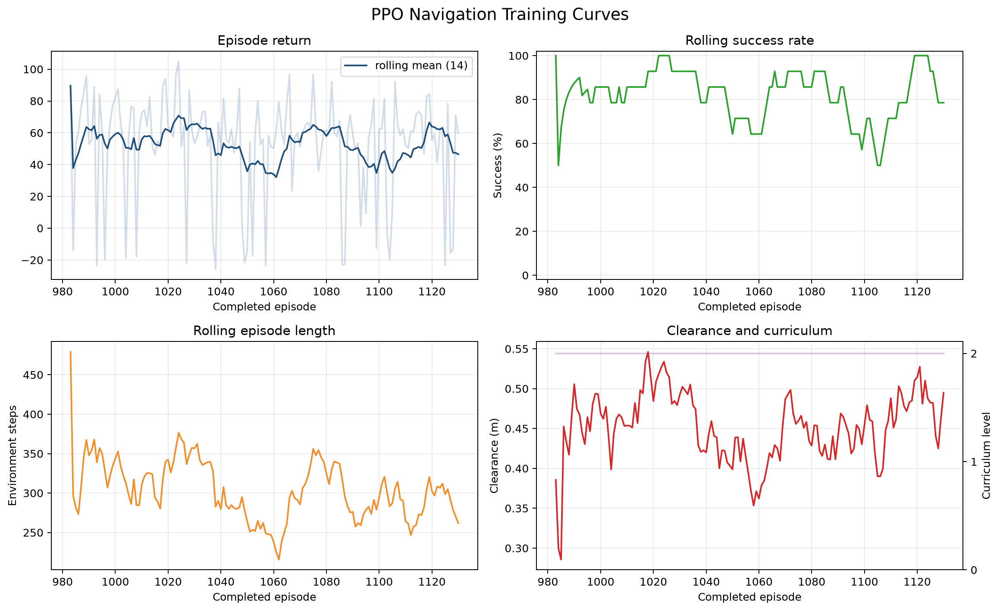
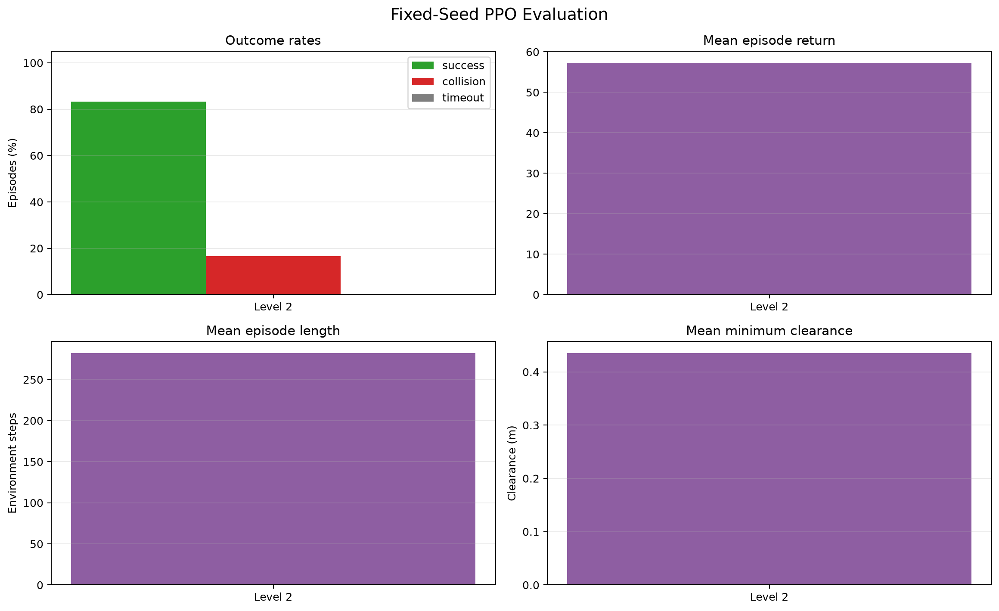
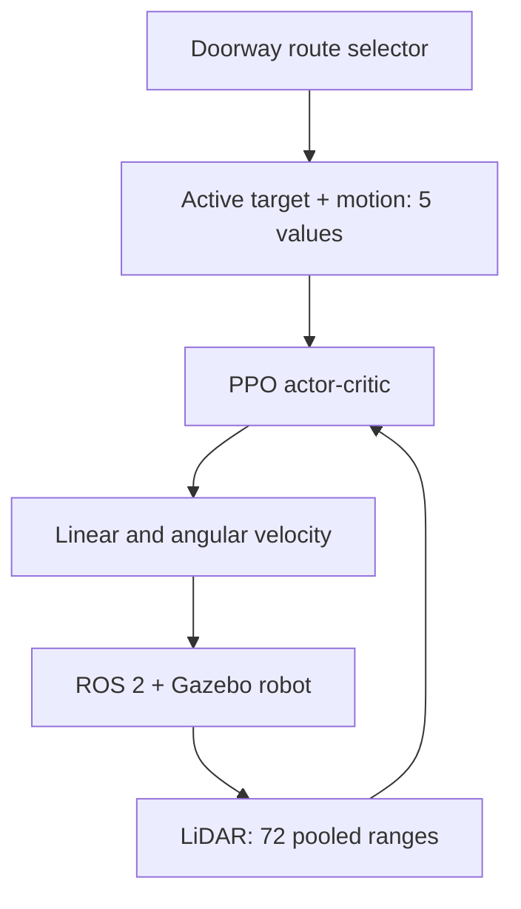

# Hybrid PPO Navigation for ROS 2 and Gazebo

A continuous-control mobile robot navigation project built with ROS 2 Jazzy,
Gazebo Harmonic, PyTorch, and a from-scratch Proximal Policy Optimisation (PPO)
implementation. The robot uses LiDAR to reach randomized goals while avoiding
randomized obstacles in a three-room simulated environment.

> **Project status:** research prototype. The selected route-guided checkpoint
> reached an 83.33% success rate on 30 unseen deterministic Level-2 episodes.
> It is not yet collision-free or ready for deployment on a real robot.

## Demonstration

- [Early training: exploration and frequent failures](docs/media/01_early_training.mp4)
- [Middle training: partial obstacle avoidance](docs/media/02_middle_training.mp4)
- [Final policy: route-guided cross-room navigation](docs/media/03_final_policy.mp4)

| Three-room Gazebo world | Final policy reaching the goal |
|---|---|
|  |  |

## Final held-out evaluation

The selected checkpoint was evaluated deterministically on 30 unseen Level-2
seeds (`90000`–`90029`). Deterministic evaluation uses `tanh(actor_mean)` rather
than training exploration noise.

| Metric | Result |
|---|---:|
| Checkpoint training steps | 263,443 |
| PPO update | 125 |
| Successes | 25 / 30 |
| Success rate | 83.33% |
| Collision rate | 16.67% |
| Timeout rate | 0% |
| Mean episode return | 57.281 |
| Mean episode length | 282.2 steps |
| Mean minimum LiDAR clearance | 0.435 m |
| Mean successful-path efficiency | 88.20% |
| Mean stuck-step fraction | 0% |

The raw CSV, trajectory CSV, summary JSON, console log, checkpoint hash, and
test logs are included under `docs/results/` and `docs/test_evidence/`.

| Training progress | Held-out evaluation |
|---|---|
|  |  |

Additional evidence: [PPO optimisation diagnostics](docs/plots/ppo_diagnostics.png)
and [top-down evaluation trajectories](docs/plots/evaluation_trajectories.png).

## What is learned and what is planned

This is a **hybrid hierarchical navigation system**:

- A small route selector uses the known doorway locations to choose an active
  subgoal when the final goal is in another room.
- PPO learns the local continuous controller: how to turn, move, avoid nearby
  obstacles, cross a doorway, and reach the active target.
- Starts, goals, robot yaw, and obstacle layouts are randomized at every
  episode reset.
- There is no fixed trajectory, scripted wheel command sequence, Nav2 local
  planner, Stable-Baselines3, RLlib, or other external RL implementation.

The doorway selector was added because a memoryless policy receiving only the
final goal bearing was repeatedly attracted to partition-wall corners. It
provides topological guidance without deciding the robot's exact motion.



## Technical design

| Component | Implementation |
|---|---|
| Observation | 72 normalized LiDAR bins + target distance + target-bearing sine/cosine + linear/angular velocity = 77 values |
| Action | Two tanh-bounded continuous values mapped to linear and angular velocity |
| Policy | PyTorch actor-critic with separate LiDAR and goal/motion encoders |
| RL algorithm | Clipped PPO with GAE, value clipping, entropy regularization, gradient clipping, and checkpoint resume |
| Curriculum | Levels randomize 2, 4, and 6 movable objects |
| Goal success | Final goal within 0.25 m |
| Collision termination | Minimum LiDAR range at or below 0.22 m |
| Global guidance | Doorway approach/exit subgoals for cross-room routes |
| Layout safety | Grid connectivity check rejects unreachable randomized layouts |
| Evaluation | Deterministic policies, fixed unseen seeds, per-episode CSV, summary JSON, and trajectories |

The PPO actor-critic contains approximately 72.8k trainable parameters. The
implementation includes the tanh-squashed Gaussian probability correction,
Generalised Advantage Estimation, rollout storage, minibatch PPO optimisation,
learning-rate annealing, curriculum state, and safe checkpoint resume.

## Repository structure

```text
.
├── src/
│   ├── description_new/        # Robot model, Gazebo world, bridges and launch
│   └── nav_learning/           # ROS environment, PPO, training and evaluation
├── models/                     # Selected 263,443-step checkpoint
├── docs/
│   ├── media/                  # Early, middle and final-policy videos
│   ├── images/                 # Two selected Gazebo screenshots
│   ├── plots/                  # Four training/evaluation figures
│   ├── results/                # Evaluation JSON and CSV evidence
│   └── test_evidence/          # Unit and integration test logs
├── README.md
└── LICENSE
```

## Requirements

- Ubuntu 24.04
- ROS 2 Jazzy
- Gazebo Harmonic and `ros_gz`
- Python 3 with PyTorch, NumPy, PyYAML, Matplotlib, and pytest

## Build

```bash
cd /path/to/ros2-hybrid-ppo-navigation

source /opt/ros/jazzy/setup.bash

# Activate your Python environment if you use one.
# source /path/to/venv/bin/activate

python3 -m pip install -r src/nav_learning/requirements_rl.txt

colcon build --symlink-install \
  --packages-select description_new nav_learning

source install/setup.bash
```

## Tests

ROS-free PPO mathematics and checkpoint tests:

```bash
python3 -m nav_learning.ppo

python3 -m pytest \
  src/nav_learning/test/test_env_math.py \
  src/nav_learning/test/test_ppo_math.py \
  -q
```

With Gazebo running, validate the complete ROS environment:

```bash
python3 -m nav_learning.random_policy_smoke_test
```

## Run the simulator

```bash
cd /path/to/ros2-hybrid-ppo-navigation
source /opt/ros/jazzy/setup.bash
source install/setup.bash

ros2 launch description_new launch_sim.launch.py
```

## Evaluate the selected policy

Run evaluation in a second terminal while the simulator remains open. Do not
run the trainer and evaluator at the same time because both publish robot
commands and reset the same Gazebo entities.

```bash
python3 -m nav_learning.evaluate_ppo \
  --checkpoint models/ppo_route_guided_263443_steps.pt \
  --levels 2 \
  --episodes-per-level 30 \
  --seed-base 70000 \
  --trajectory-episodes-per-level 10 \
  --device cuda \
  --output-dir evaluation_level2_30
```

## Generate plots

```bash
python3 -m nav_learning.plot_ppo_results \
  --run-dir runs/ppo_navigation/run_20260829_route_fix_seed7 \
  --evaluation-dir evaluation_level2_30 \
  --output-dir plots_level2_30
```

The plotting utility can create training curves, PPO optimisation diagnostics,
evaluation outcome charts, and top-down trajectories.

## Train or resume

```bash
python3 -m nav_learning.train_ppo \
  --config src/nav_learning/config/ppo_training.yaml \
  --resume models/ppo_route_guided_263443_steps.pt \
  --run-dir runs/ppo_navigation/continued_training \
  --total-timesteps 600000
```

## Known limitations

- The final evaluation succeeds in 25 of 30 hardest-level episodes; local
  obstacle avoidance still fails in a minority of layouts.
- Doorway locations come from known world topology rather than being inferred
  from a learned map.
- The policy is feed-forward and has no recurrent memory.
- Results are simulation-only and have not been validated on real hardware.
- Dynamic-obstacle behavior and sim-to-real robustness still need dedicated
  evaluation.

## Planned work

- Complete a larger held-out benchmark and confidence intervals.
- Add behavior cloning demonstrations and compare PPO, BC, and PPO+BC.
- Compare the continuous-control policy with SAC.
- Investigate recurrent policies or learned topological representations.
- Add domain randomization and deploy the controller on a physical robot.

## Author

[Harivathsha](https://github.com/Harivathsha)

## License

Apache-2.0. See [LICENSE](LICENSE).
